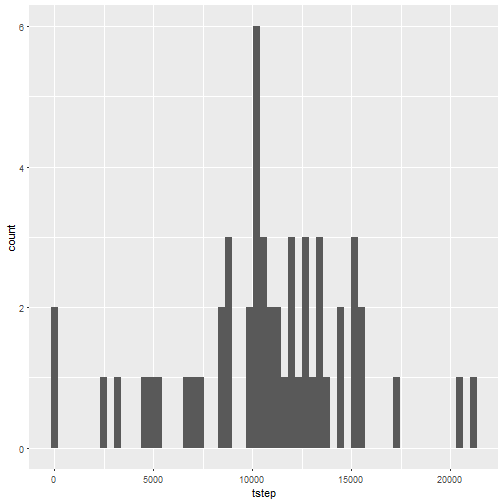
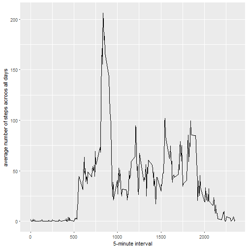
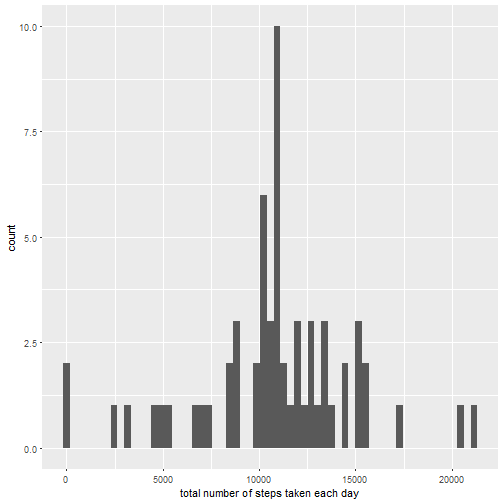
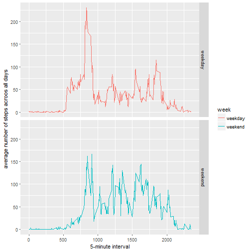

Loading data assuming the data is already in the working directory

```r
a<-read.csv("activity.csv")
```

Calculating the total number of steps taken per day and ploting using ggplot2

```r
am<-a[complete.cases(a),]
ts<-tapply(am$steps,am$date,sum)
df<- data.frame(date = names(ts), tstep = ts)
library(ggplot2)
g<-ggplot(df,aes(tstep))
g+geom_histogram(bins = 61)
```

```
## Warning: Removed 8 rows containing non-finite values (stat_bin).
```



The mean and median of the steps taken per day

```r
tm<-mean(ts,na.rm=TRUE)
tm
```

```
## [1] 10766.19
```

```r
tmd<-median(ts,na.rm=TRUE)
tmd
```

```
## [1] 10765
```

Time series plot based on the interval

```r
library(plyr)
ami<-am[,c(1,3)]
tsi<-ddply(ami,.(interval),colwise(mean))
library(ggplot2)
g<-ggplot(tsi,aes(interval,steps))
g+geom_line()+labs(x="5-minute interval", y="average number of steps acroos all days")
```



Total number of missing value

```r
sum(is.na(a$steps))
```

```
## [1] 2304
```

Filling missing values with mean value of the interval

```r
amna<-a[is.na(a$steps),]
ana<-merge(tsi,amna,by = "interval")
ana2<-ana[,c(2,4,1)]
names(ana2)<-names(am)
newa<-rbind(am,ana2)
```

plotting new dataset

```r
newa2<-newa[,c(1,2)]
tsn<-ddply(newa2,.(date),colwise(sum))
library(ggplot2)
g<-ggplot(tsn,aes(steps))
g+geom_histogram(bins = 61)+labs(x="total number of steps taken each day")
```



The mean and median of the steps taken per day for the new data

```r
tmn<-mean(tsn$steps)
tmn
```

```
## [1] 10766.19
```

```r
tmdn<-median(tsn$steps)
tmdn
```

```
## [1] 10766.19
```
Do these values differ from the estimates from the first part of the assignment?

Estimating the missing values doesn't change the shape of the histogram. The mean did not changed. The median matches with mean now

What is the impact of imputing missing data on the estimates of the total daily number of steps?

The total daily number of steps increases as a result of added values, specially around the mean.


Creating weekday & weekend factor variable

```r
newa$dates<-strptime(newa$date,"%Y-%m-%d")
newa$w<-weekdays(newa$dates)
newa$week<-ifelse(newa$w %in% c("Saturday","Sunday"),"weekend","weekday")
```

Plotting new data set

```r
newa3<-newa[,c(1,3,6)]
tsn<-ddply(newa3,.(interval,week),colwise(mean))
g<-ggplot(tsn,aes(interval,steps,color=week))
g+geom_line()+facet_grid(factor(week)~.)+labs(x="5-minute interval", y="average number of steps acroos all days")
```


